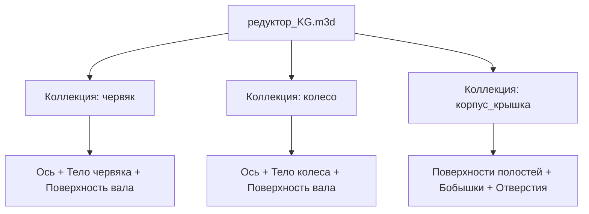

# 📐 Тема 1: Методология Top-Down и Компоновочная сборка

> [!IMPORTANT]
> **Методология Top-Down (проектирование сверху вниз)** — это подход, при котором вся сборка управляется из единого центрального файла «Компоновочной геометрии» (КГ). Изменения в КГ автоматически транслируются во все детали сборки.

---

## 🛠️ Пошаговый алгоритм проектирования

### Шаг 1: Подготовка файла-контейнера
1. Создайте новую деталь в КОМПАС-3D.
2. В свойствах модели (правый клик по корню дерева → **Свойства модели**) укажите:
   * **Наименование:** `редуктор_KG`
   * **Обозначение:** `РПНТ.22.50.00.00` *(по кодировке ЦПТИ Росатома)*
3. Сохраните файл в рабочую папку проекта.

### Шаг 2: Параметризация через панель переменных
1. Откройте панель **«Переменные»** (меню *Настройка → Панели → Переменные*).
2. Задайте основные параметры передачи:

| Имя переменной | Выражение / Значение | Комментарий |
| :--- | :--- | :--- |
| **A** | `180` | Межосевое расстояние (мм) |
| **M** | `5` | Модуль червячной передачи |
| **D1** | `50` | Диаметр вала червяка под подшипник |
| **D2** | `75` | Диаметр вала колеса под подшипник |

> [!TIP]
> В версиях КОМПАС-3D v23/v24 в ячейках формул можно использовать встроенную функцию поиска математических выражений (кнопка **«Вставить функцию»**).

### Шаг 3: Построение плоскостей и эскизов осей
1. Выберите плоскость **ZX** (горизонтальная плоскость колеса).
2. Выберите команду **«Смещенная плоскость»**. Сместите её на расстояние `A` (введите переменную `A` в поле расстояния) в направлении оси Y.
3. Назовите плоскость: **«плоскость червяка»**.
4. На плоскости **ZX** создайте эскиз: отрезок вдоль оси вращения колеса. Назовите эскиз: **«ось колеса»**.
5. На смещенной плоскости создайте эскиз: перпендикулярный отрезок вдоль оси червяка. Назовите эскиз: **«ось червяка»**.

---

## ⚙️ Построение базовой геометрии деталей

### Червяк
1. На плоскости **ZY** создайте **«эскиз червяка»** (контур витков и посадочных шеек).
   * *Убедитесь, что эскиз полностью определен и окрашен в зеленый цвет.*
2. Примените команду **«Вращение»** в режиме *Новое тело*. Назовите операцию в дереве: **«червяк»**.
3. Для прорисовки поверхности вала: на плоскости **ZY** постройте прямоугольный эскиз ступени вала (используя размерную переменную `D1`) и примените **«Поверхность вращения»**.

### Червячное колесо
1. На плоскости **XY** создайте **«эскиз колеса»** (диск, ступица, венец).
2. Примените команду **«Вращение»** в режиме *Новое тело* (чтобы отделить его от тела червяка). Назовите операцию: **«колесо»**.
3. Для прорисовки вала колеса: на плоскости **XY** создайте эскиз с использованием переменной `D2` и выполните **«Поверхность вращения»**.

---

## 🏢 Компоновка внутренней полости и контура корпуса

1. **Внутренняя полость:**
   * На плоскости **ZY** постройте эскиз габаритов внутренней полости редуктора с учетом зазоров для масла.
   * Выполните команду **«Поверхность выдавливания»** на расстояние **149 мм** с опцией *Симметрично*. Замкните поверхность и назовите: **«внутренняя полость»**.
2. **Внешний контур корпуса:**
   * На плоскости **ZX** постройте эскиз внешнего очертания лап и стенок.
   * Выполните команду **«Поверхность выдавливания»**, задав эквидистантное смещение от граней внутренней полости на величину толщины стенки — **5.5 мм**. Назовите: **«внешний контур»**.
3. **Бобышки под подшипники:**
   * На торцевой поверхности внешнего контура создайте эскиз отверстия под вал колеса (диаметр **90 мм**).
   * Используйте новую команду **«Конус» (новинка v24)**: точка привязки — пересечение оси колеса с гранью корпуса, диаметр основания — **223 мм**, вершины — **215 мм**, высота — **48 мм**.
   * Используйте команду **«Цилиндр» (v23)** в режиме вычитания: привязка к центру конуса, диаметр — **150 мм**, высота — *«через всё»* (применить только к телу конуса).

---

## 📦 Создание «Коллекций геометрии» для экспорта

Чтобы детали сборки ссылались на КГ без создания взаимных циклических связей, сгруппируйте объекты в **Коллекции геометрии** (*меню Моделирование → Коллекция геометрии*):

* **Коллекция `червяк`:** «плоскость червяка», «ось червяка», «эскиз червяка», тело «червяк», поверхность вала червяка.
* **Коллекция `колесо`:** «ось колеса», «эскиз колеса», тело «колесо», поверхность вала колеса.
* **Коллекция `корпус_крышка`:** «внутренняя полость», «внешний контур», тело конуса бобышки, эскиз крепежных отверстий.

---
*Конспект подготовлен по материалам курса @ИванКошманов-ж3п для КОМПАС-3D v24.*
