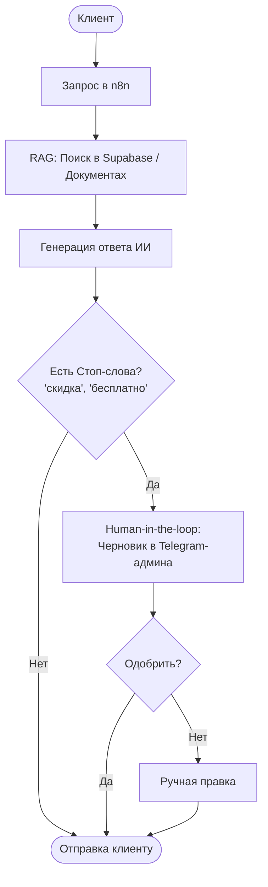

# 🚀 ИИ-Автоматизация Бизнеса в СНГ: Полная Стратегия 2026
> **На основе анализа концептов и материалов AI Mastodont.**
> *Продаем не «нейросети», а сокращение ФОТ, избавление от операционного ада и измеримый ROI.*

---

## 🧰 1. СТЕК СВЕРХСКОРОСТЕЙ ($0)

| Инструмент | Роль в бизнесе | Практическое применение |
|:---|:---|:---|
| **Google AI Studio** *(Gemini 3.1 Pro)* | **Мозг** системы | Использование как бесплатного бесконечного чата с окном контекста в миллионы токенов. Съедает книги, базы данных, весь код проекта. |
| **Google Antigravity** | **Завод** (Vibe-Coding) | Облачная среда разработки через чат и голос. Генерирует готовые работающие сайты и приложения, разворачивает превью и выдает ссылки за минуты. |
| **NotebookLM** | **Консультант / RAG** | Превращает локальные файлы, PDF и переписки в закрытого ИИ-эксперта с нулевыми галлюцинациями. |
| **n8n (Self-hosted)** | **Оркестратор** | Визуальный конструктор процессов. Запуск на локальном Docker-сервере в РФ полностью закрывает требования 152-ФЗ. |

---

## 🔑 СКИЛЛ-ПАКЕТ 2026: КЛЮЧЕВЫЕ ТЕХНОЛОГИИ ЗАРАБОТКА

### 🛡️ СКИЛЛ 1: Протокол безопасности «Анти-Галлюцинация»
> **Как защитить бизнес от ошибок ИИ (скидки 90%, оскорбления, утечки)**

Согласно законодательству РФ, гражданско-правовую ответственность за ошибки ИИ перед клиентами несет **владелец бизнеса**. Твоя задача как архитектора — защитить его.

1. **Human-in-the-loop (Узел согласования):** Агент в n8n не шлет ответ в канал сразу. Он создает черновик сообщения и присылает менеджеру в Telegram. Менеджер нажимает инлайн-кнопку `[Одобрить]` или `[Редактировать]`.
2. **RAG-фильтр:** Ограничение базы знаний строго документами (PDF, Excel). Если ответа нет в базе — агент вежливо переводит диалог на оператора, а не фантазирует.
3. **Фильтр стоп-слов:** Автоматический перехват в n8n триггеров («скидка», «бесплатно», «гарантия») для обязательного ручного аппрува.

---

### 💵 СКИЛЛ 2: РФ-Интеграции («Святая Троица» B2B)
> **То, за что СНГ-предприниматели платят 150 000+ ₽ без лишних разговоров**

*   **Т-Банк / Сбербанк (СБП):** Настройка HTTP-узлов в n8n для автоматической генерации ссылок на оплату прямо внутри диалога. ИИ-агент видит вебхук об успешном поступлении денег и выдает товар/доступ мгновенно.
*   **1С:Предприятие:** Интеграция по API для синхронизации остатков на складах. ИИ-продавец видит реальный баланс товаров и предлагает аналоги, если позиция закончилась.
*   **Битрикс24 / amoCRM:** Полный цикл лид-менеджмента. ИИ не просто создает сделку, а скрапит сайт клиента через **Firecrawl**, анализирует его боли с помощью Claude API и обогащает карточку лида (AI Enrichment) перед звонком менеджера.

---

### 📈 СКИЛЛ 3: GEO-оптимизация (Generative Engine Optimization)
> **Трафик в эпоху смерти классического SEO**

В 2026 году классический поиск просел на 30% — пользователи делегируют поиск нейросетям (Alice AI, GigaChat, Perplexity). GEO — это оптимизация под выдачу ИИ.

*   **Цитируемость:** Написание экспертных кейсов на площадках, которые активно парсят отечественные LLM (Habr, vc.ru, TenChat, Сиолошная).
*   **Semantic Clusters:** Группировка статей по строго определенным тематическим кластерам (например, «Автоматизация n8n для недвижимости») для завоевания «тематического авторитета» (Topic Authority).
*   **Формат FAQ:** Писать контент в явном структурированном виде «Вопрос-Ответ» — ИИ обожает выдергивать готовые блоки.

---

## 🏆 ЗОЛОТЫЕ СВЯЗКИ ДЛЯ СНГ (ТОП-7)

### 1. B2B: "Travel & E-com Lead Reviver" (Оживитель холодных баз)
*   **Стек:** n8n + WhatsApp Business API + CRM.
*   **Суть:** ИИ-агент обходит старую «мертвую» базу лидов в CRM, заводит персонализированный диалог («Вы интересовались туром в прошлом году...») и возвращает клиентов к сделке.
*   **Чек:** 100 000 – 250 000 ₽ под ключ + % от спасенных продаж.

### 2. B2B: "Speed-to-Lead" Voice Agent (Голосовой звонарь)
*   **Стек:** Vapi + n8n + Битрикс24.
*   **Суть:** Звонок клиенту через 5 секунд после отправки формы на сайте. Голосовой ИИ-ассистент квалифицирует лида, отвечает на вопросы по прайсу и сам забивает встречу в календарь.
*   **Чек:** 150 000 – 300 000 ₽.

### 3. CRM: AI Lead Enrichment "Sparky" (Умный лид-менеджер)
*   **Стек:** Firecrawl + Claude API + Google Sheets / CRM.
*   **Суть:** При поступлении заявки робот скрапит сайт и соцсети потенциального клиента, находит его более, слабые места и пишет готовое, гипер-персонализированное коммерческое предложение для менеджера по продажам.
*   **Чек:** 80 000 – 120 000 ₽.

### 4. Корпорации: On-Premise RAG База Знаний
*   **Стек:** n8n + Supabase + Ollama (локально на сервере в РФ).
*   **Суть:** Внутренний корпоративный ИИ-помощник, знающий все прайсы, регламенты и коммерческие тайны. Работает абсолютно приватно, без отправки данных за рубеж.
*   **Чек:** 250 000 – 500 000 ₽.

### 5. Малый бизнес: Маркетплейс-Автоматизатор
*   **Стек:** n8n + Wildberries/Ozon API + `@mpstudiopicbot`.
*   **Суть:** Авто-ответы на отзывы (с вытягиванием только 5-звездочных в приоритет), умная генерация карточек и SEO-оптимизация описаний под алгоритмы площадок.
*   **Чек:** 60 000 – 90 000 ₽.

### 6. Репутационный щит: Real-Time Мониторинг
*   **Стек:** HTTP-парсеры + Telegram Bot.
*   **Суть:** Моментальный перехват негативных отзывов на Otzovik / Яндекс.Карты / 2ГИС. Бот тут же пишет проект вежливого и улаживающего конфликт ответа и шлет его в чат поддержки.
*   **Чек:** 50 000 – 80 000 ₽.

### 7. Фриланс 2.0: AI-видеогенератор для Shorts/TikTok
*   **Стек:** HeyGen + ElevenLabs + ManyChat + `@BananogenBot`.
*   **Суть:** Создание виртуального ИИ-клона эксперта/предпринимателя, который сам штампует сотни вертикальных роликов по сценариям и ведет авто-переписку в директе.
*   **Чек:** ретейнер от 150 000 ₽ / мес.

---

## 📈 МАТЕМАТИКА ПРОДАЖ (ROI-ТАРАН)

Никогда не продавай «ИИ-ботов». Продавай **ROI** и **экономию ФОТ**.

### 🧮 Пример расчета для B2B (Отдел продаж/поддержки из 5 человек):
*   **Текущие расходы бизнеса:** 5 менеджеров × 120 000 ₽ (зарплата + налоги + рабочее место) = **600 000 ₽ / месяц** (7.2 млн ₽ в год).
*   **Твой оффер:** Мультиагентный ИИ-ассистент на n8n за **250 000 ₽** (разовое внедрение) + **40 000 ₽ / месяц** за техподдержку.
*   **Результат:** Бизнес оставляет 1 сильного старшего менеджера для контроля («Human-in-the-loop»). 4 позиции сокращаются.
*   **Чистая экономия за первый год:**
    $$\text{Экономия} = (7\,200\,000\text{ ₽}) - (1\,200\,000\text{ ₽}) - 250\,000\text{ ₽} - (40\,000\text{ ₽} \times 12) = \mathbf{5\,270\,000\text{ ₽}}$$

> **«Якорь-фраза» для ЛПР:**
> *«Вы инвестируете 250 тысяч один раз, чтобы сэкономить более 5 миллионов рублей за год. ИИ-сотрудник не уйдет в декрет, не проспит, не попросит премию и будет отвечать за 5 секунд 24/7/365».*

---

## ⚙️ ПСИХОЛОГИЯ СДЕЛКИ: ТРЕХУРОВНЕВАЯ СЕТКА (Good-Better-Best)

| Тариф | Решение | Цена | Психологическая роль |
|:---|:---|:---|:---|
| **«Старт»** | Простой FAQ Telegram-бот без интеграций и памяти. | **35 000 ₽** | Снять первичный скепсис, быстрый старт с минимальным риском. |
| **«Бизнес»** | ИИ-ассистент с RAG-памятью, интеграцией в Bitrix24/amoCRM и мессенджеры. | **130 000 ₽** | **Основной Якорь.** Покупают 80% клиентов. Закрывает большинство задач. |
| **«VIP»** | Полная мультиагентная система (1С, CRM, СБП, n8n, обучение сотрудников). | **350 000 ₽+** | Показывает масштаб твоих компетенций. Делает тариф «Бизнес» психологически очень дешевым. |

---

## 🗺️ КАРТА ЗАПУСКА ЗА 7 ДНЕЙ (ПЛАН ДЕЙСТВИЯ)

- [ ] **День 1: Выбор и Демо.** Выбери одну нишу (например, ИИ-продавец для автосалонов). Собери простое работающее демо-решение в n8n.
- [ ] **День 2-3: Артефакт.** Запиши 2-минутное видео экрана (Artifact), показывающее, как ИИ парсит данные и сам заносит их в CRM.
- [ ] **День 4: Упаковка.** Оформи кейс на vc.ru или в TenChat. Создай простую страницу-витрину в Notion с тарифами (35к / 130к / 350к).
- [ ] **День 5-6: Трафик.** Зарегистрируйся на **Binetex.ru** (0% комиссии) и **Авито Услуги**. Размести объявления. Сделай 10 экспертных комментов в целевых чатах предпринимателей.
- [ ] **День 7: Закрытие.** Предложи бесплатный «Аудит рутины бизнеса» (15 минут), найди узкое горлышко и продай тариф «Бизнес» через ROI-таран.

---
**Разработано AntiGravity AI Knowledge Base | 19 мая 2026**
*Источник концепций: Мастодонт (https://teletype.in/@mastadont/money)*
