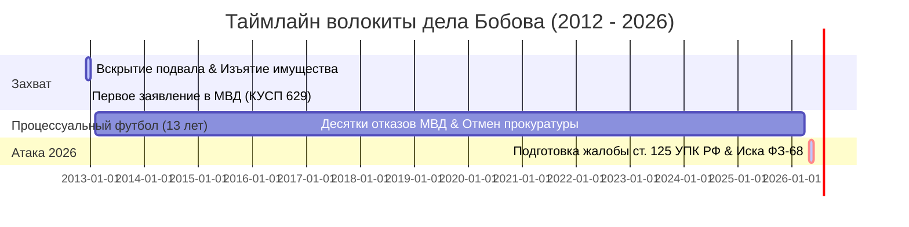

# ⚖️ Хронологическая Карта Дела Бобова О.И. (13-летняя Волокита)
> **Стратегическое досье по защите законных прав и возврату активов на сумму 12.4 млн руб.**
> *Цель: Сломать процессуальный саботаж и форсировать уголовное дело.*

---

## 📅 ХРОНОЛОГИЯ КЛЮЧЕВЫХ СОБЫТИЙ

### 🚨 1. Точка отсчета: Захват и разграбление (Декабрь 2012 — Январь 2013)
*   **Событие:** Управляющая компания «Новоуральская» совместно с подрядчиком «Управдом Авто» без законных оснований (без решения суда и судебных приставов) вскрыли подвальное помещение дома № 1 по ул. Строителей в г. Новоуральске.
*   **Контекст:** В этом помещении с 1980 года Бобов О.И. на законных правах содержал Клуб юных моряков («ККМ»).
*   **Ущерб:** Изъяты и вывезены дорогостоящие профессиональные станки, оборудование, материалы, интеллектуальная собственность, а также **4 тримарана Corsair F-31**.
*   **Сумма ущерба:** **12 401 207 рублей** (в ценах 2013 года, без учета индексации).
*   **Состояние активов:** Часть имущества выброшена на свалку как «мусор», часть брошена ржаветь под открытым небом на территории подрядчика под снегом.

### 🔄 2. Процессуальный футбол МВД (2013 — 2026)
*   **07.12.2012:** Подано первое заявление в полицию (**КУСП № 629**).
*   **13 лет волокиты:** Органы ОВД г. Новоуральска систематически выносили незаконные постановления об отказе в возбуждении уголовного дела. Каждое из них отменялось прокуратурой как необоснованное, после чего материал отправлялся на «новый круг» проверки.
*   **Ключевой абсурд следствия:** Полиция Новоуральска годами путала **ст. 131 ГПК РФ** (форма искового заявления) со **ст. 131 УК РФ** (Изнасилование, абсолютно неприменимо!), усматривая в действиях УК «обычные коммунальные работы по расчистке ТБО» и полностью игнорируя состав кражи (ст. 158 УК РФ).

---

## 🗂️ КАРТА ДОКАЗАТЕЛЬСТВЕННОЙ БАЗЫ

| Документ / Доказательство | Значение | Где искать в Obsidian |
| :--- | :--- | :--- |
| **Жалоба в порядке ст. 125 УПК РФ** | Главный инструмент обжалования бездействия следователей в Суде. | [[1_PROJECTS/BOBOV/complaint_125_upk_v1\|📝 Жалоба ст. 125 УПК РФ]] |
| **Сводная ведомость ущерба 12.4 млн** | Детализация стоимости оборудования для квалификации ч. 4 ст. 158 УК РФ. | [[1_PROJECTS/BOBOV/evidence_synthesis_12m\|📊 Синтез ущерба]] |
| **Исковое заявление по ФЗ № 68-ФЗ** | Взыскание компенсации с Госказны за нарушение разумного срока следствия. | [[1_PROJECTS/BOBOV/claim_fz68_compensation_v1\|💸 Иск к казне]] |
| **Официальный синопсис по делу** | Краткий отчет-инструкция для Олега Ивановича. | [[1_PROJECTS/BOBOV/report_for_father\|📜 Резюме защиты]] |
| **Полное досье дела (v3)** | Definitive PDF-сборник всех материалов. | [📕 PDF ДОСЬЕ (Сборка)](file:///C:/ANTIGRAVITY/1/obsidian_brain/1_PROJECTS/BOBOV/Bobov_Legal_Attack_Complete_2026_v3.pdf) |

---

## 🛡️ СТРАТЕГИЧЕСКАЯ ТАКТИКА «АТАКА 2026»

### 1. Уход от ст. 330 (Самоуправство) к ч. 4 ст. 158 (Кража)
*   **Проблема:** Срок давности по ст. 330 УК РФ составляет всего **2 года** и давно истек. УК прикрывается этим, чтобы избежать ответственности.
*   **Решение:** Удерживание чужого имущества в течение 13 лет без возврата законному владельцу переводит состав в **хищение (кражу в особо крупном размере)**. Срок давности по ч. 4 ст. 158 УК РФ составляет **10 лет**, и этот срок систематически прерывался и продлевался незаконными действиями МВД, что дает суду право восстановить его.

### 2. «Удар по казне» (ФЗ № 68-ФЗ)
*   Если следствие умышленно саботировало расследование 13 лет, государство обязано выплатить Бобову О.И. компенсацию за неэффективное следствие и волокиту. Это перекладывает финансовое давление на бюджет МВД, заставляя руководство ведомства выдать виновных лиц из УК.

### 3. Заявление о Халатности (ст. 293 УК РФ)
*   Подача коллективного заявления в Следственный комитет РФ на следователей ОВД г. Новоуральска, которые за 13 лет допустили утрату вещественных доказательств и порчу изъятого оборудования под открытым небом.

---
**Разработано юридическим крылом AntiGravity AI (v2.2)** | [[DASHBOARD|🚀 Вернуться на Дашборд]]
