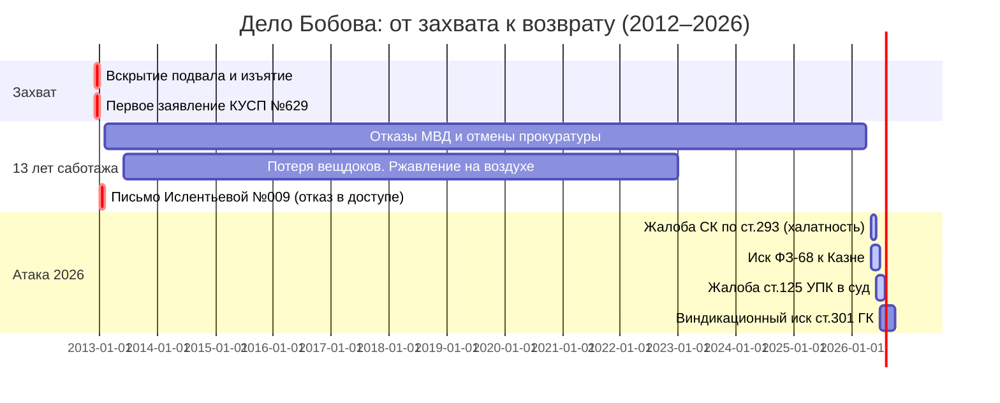

# ⚖️ КАРТА ДЕЛА БОБОВА — Полная Боевая Стратегия v3.0

> **12 401 207 рублей украдено. 13 лет саботажа. Сейчас — атака.**
> *Стратегия: не жаловаться — атаковать. Держим три фронта одновременно.*

---

## 📅 ТАЙМЛАЙН



---

## 🗂️ ФАКТУРА ДЕЛА

### Объект и ущерб

| Параметр | Значение |
|----------|----------|
| **Адрес мастерской** | г. Новоуральск, ул. Строителей, д. 1 (подвал) |
| **Период пользования** | с 1980 г. — Клуб юных моряков (ККМ) |
| **Дата захвата** | Декабрь 2012 — Январь 2013 |
| **УК-исполнитель** | ООО «Новоуральская УК» (дир. **Ислентьева И.В.**) |
| **Подрядчик вывоза** | ООО «Управдом Авто» |
| **Место хранения** | Центральный проезд, д. 6 (склад подрядчика) |
| **КУСП №** | 629 |
| **Оценка ущерба (2013)** | **12 401 207 рублей** |
| **С индексацией 2026** | ~24–28 млн рублей |

### Ключевые объекты имущества

| Категория | Описание | Оценка (руб.) |
|-----------|----------|---------------|
| 🚢 Тримараны Corsair F-31 | 4 комплекта для сборки (мачты, паруса, кили) | ~3 500 000 |
| 🔧 Станки и оборудование | Профессиональное, для судостроения | ~4 200 000 |
| 📐 ИС / Чертежи | Авторские чертежи судов F-314 | ~1 800 000 |
| 🧰 Инструменты и материалы | 65 позиций согласно описи КУСП | ~2 900 000 |
| **ИТОГО** | | **≈ 12 401 207** |

### Ключевые лица

| Роль | ФИО | Статус |
|------|-----|--------|
| Потерпевший | **Бобов Олег Иванович** | Заявитель |
| Директор УК | **Ислентьева И.В.** | Обвиняемая (ст. 330, 293) |
| Подрядчик | **Мовланов Т.Р.** / ООО «Управдом Авто» | Фигурант |
| Чиновник ГЖИ | **Юковецкий** | Соучастник (ст. 286 ч.3) |
| Следователи ОВД | Установить из дела | Халатность (ст. 293) |

---

## 🔑 КЛЮЧЕВЫЕ ДОКУМЕНТЫ-ДОКАЗАТЕЛЬСТВА

| Документ | Значение | Статус |
|----------|----------|--------|
| **Письмо Ислентьевой №009 от 28.01.2013** | Отказ в доступе к имуществу = умысел | 🔴 Нужна копия |
| **КУСП №629 (полное дело)** | Вся история 13 лет | 📋 Запрос в МВД |
| **Фото склада Центральный проезд, 6** | Акт хранения вещей = ст. 906 ГК | 🔴 Нужна фиксация |
| **Акт об отсутствии осмотра склада** | Доказывает халатность следствия | 🔴 Нужен адвокат |
| **Опись 65 позиций имущества** | Квалификация ч.4 ст.158 (особо крупный) | ✅ В базе |
| **Отказы в возбуждении + Отмены прокурора** | Хронология саботажа | ✅ В базе |

---

## ⚖️ ПРАВОВОЙ АРСЕНАЛ — Новые Аргументы v3.0

### 🔑 СКИЛЛ 1: «Взлом срока давности» — ст. 906 ГК РФ
> **Хранение в силу закона**

Если УК в своих письмах признала факт вывоза имущества — она стала **хранителем по закону** (ст. 906 ГК). Срок исковой давности по виндикации начинает течь **не с 2013 года**, а с момента **официального отказа вернуть имущество**.

Письмо Ислентьевой №009 от 28.01.2013 = **первый официальный отказ**.
→ Срок давности по ст. 301 ГК (виндикация) = 3 года с 28.01.2013 = истёк.
→ НО: если хранение длилось дольше и были новые обращения — каждое **прерывает срок**.
→ **Применение:** последнее письмо/отказ УК = точка отсчёта нового срока.

### 🔑 СКИЛЛ 2: «Разгром мусорной версии» — ст. 226 ГК РФ
> **Бесхозяйная вещь — только через суд**

Статус «мусора/ТБО» можно присвоить имуществу ТОЛЬКО:
1. Если вещь **утратила потребительские свойства**, ИЛИ
2. Через **решение суда** (если стоимость < 5 МРОТ)

УК сделала это самовольно → **автоматически ст. 330 УК (самоуправство)**, минимум.
Стоимость тримарана F-31 = $65 000–94 000 → никакой ТБО быть не может юридически.

### 🔑 СКИЛЛ 3: «Тройной удар» — три фронта
> Не ждать — атаковать параллельно

```
ФРОНТ 1: СК РФ (ст. 293 — Халатность)
→ На следователей ОВД Новоуральска
→ За утрату вещдоков и 13 лет бездействия
→ Цель: уголовное дело против МВД

ФРОНТ 2: Суд ст. 125 УПК РФ
→ Оспаривание всех постановлений об отказе
→ Обязать возбудить дело
→ Цель: судебный прецедент

ФРОНТ 3: Иск по ФЗ-68 к Казне
→ За нарушение разумного срока следствия
→ Компенсация 500 000 – 2 000 000 руб.
→ Цель: деньги + давление на МВД изнутри
```

### 🔑 СКИЛЛ 4: «Телеграмма» — обход отказа от писем
> Тактика доставки юридически значимых уведомлений

Если УК отказывается принимать заказные письма:
1. Отправить **телеграмму через Почту России** с уведомлением
2. Отметка «адресат отказался от получения» = **юридически равносильна вручению**
3. Суды принимают это как доказательство надлежащего уведомления

### 🔑 СКИЛЛ 5: «Квалификация убийцы» — ч. 3 ст. 286 УК для ГЖИ
> Превышение должностных полномочий с тяжкими последствиями

Для чиновника ГЖИ **Юковецкого** (если он санкционировал вскрытие):
- **Ст. 286 ч.3 УК РФ** — срок давности **15 лет** (до 2028 года!)
- Это единственный фигурант, по которому срок ещё НЕ ИСТЁК для уголовного преследования

---

## 🗺️ ПЛАН АТАКИ — Пошаговые Действия

### ЭТАП 1 — БРОНЯ (сейчас, май 2026)
- [ ] Запросить в МВД Новоуральска **полный материал КУСП №629** (все постановления + фото)
- [ ] Получить копию **письма Ислентьевой №009 от 28.01.2013**
- [ ] Зафиксировать нотариально: фото склада Центральный проезд, 6
- [ ] Составить хронологию всех отказов + отмен прокуратуры (таблица)

### ЭТАП 2 — КАПСУЛА (июнь 2026)
- [ ] Подать **жалобу в СК РФ** по ст. 293 (готовый текст есть в базе)
- [ ] Подать **жалобу по ст. 125 УПК** в Новоуральский горсуд
- [ ] Направить нотариальное требование о возврате имущества в УК (телеграмма)

### ЭТАП 3 — КАЗНА (июль 2026)
- [ ] Подать **иск по ФЗ-68** в Новоуральский горсуд
- [ ] Запросить публичную поддержку (журналист Иннокентий Шеремет)
- [ ] Организовать публикацию в местных СМИ

### ЭТАП 4 — ВИНДИКАЦИЯ (август–октябрь 2026)
- [ ] Гражданский иск о **виндикации** (ст. 301–302 ГК РФ) или возмещении ущерба
- [ ] Альтернатива: мировое соглашение с УК на сумму ≥5 млн руб.

---

## 📚 ИСТОЧНИКИ И МАТЕРИАЛЫ В БАЗЕ

| Файл | Содержание |
|------|-----------|
| `Gemini_Chat_Bobov_FULL_31msg.md` | Полная история разработки стратегии (31 сообщение) |
| `complaint_125_upk_v1.md` | Готовая жалоба по ст. 125 УПК |
| `claim_fz68_compensation_v1.md` | Иск к Казне по ФЗ-68 |
| `BOBOV_LEGAL_ATTACK.md` | Первоначальная стратегия атаки |
| `evidence_synthesis_12m.md` | Синтез ущерба 12 млн |
| `complaint_prosecutor_final.txt` | Финальная жалоба прокурору |
| `court_precedents_report.md` | Судебная практика по аналогичным делам |
| `notary_request_letter.md` | Нотариальное требование |
| `ultimatum_notary_final.md` | Ультиматум УК |

---

## 🤖 ИИ-ПОДДЕРЖКА ПРОЕКТА (AntiGravity Stack)

```
NotebookLM Notebook: ⚖️ AntiGravity: Дело Бобова
  └── 23 источника (стратегия, жалобы, переписка, Gemini-чат)

Obsidian Vault: C:\ANTIGRAVITY\1\obsidian_brain\
  └── Git-бэкап → github.com/1898baron-lab/AntiGravity_Bobov_App
  └── Авто-коммит каждые 30 минут

Мониторинг: daily_news_monitor.py
  └── Ежедневно 09:00 → новые ИИ-инструменты в 0_INBOX
```

---

**Версия 3.0 — Обновлено AntiGravity AI | 19 мая 2026**
*Применены: ст. 906 ГК, ст. 226 ГК, тактика телеграммы, скиллы 1–5, Obsidian CLI, Bases*

[[DASHBOARD|🚀 Вернуться на Дашборд]] | [[1_PROJECTS/BOBOV/complaint_125_upk_v1|📝 Жалоба 125 УПК]] | [[1_PROJECTS/BOBOV/claim_fz68_compensation_v1|💸 Иск к Казне]]
