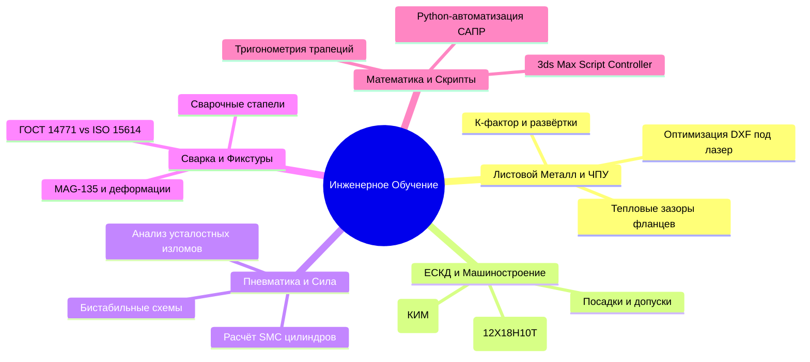

# 🎓 Академия Конструктора: Инженерная школа ЦПТИ
*Наставник: Афанасьев А.И. | Виртуальный ко-пилот: Antigravity*

Кирилл, это твоя персональная траектория роста от инженера-конструктора до ведущего разработчика сложных машиностроительных и робототехнических систем. Наша цель — не просто выполнять рутинные чертежи, а глубоко понимать физику процессов, технологию производства и стандарты проектирования (ЕСКД, ГОСТ, ISO).

---

## 🧭 Карта Инженерных Дисциплин (На базе твоих проектов)

---

## 📚 Модуль 1: Проектирование Листовых Конструкций (Проект: МАНГАЛ)
*Прямо сейчас у тебя открыт файл: `side_long.dxf`*

### 1. Теория гибки листового металла
*   **К-Фактор (K-Factor):** Отношение положения нейтрального слоя к толщине металла.
    $$K = \frac{t}{T}$$
    где $t$ — расстояние от внутренней поверхности изгиба до нейтрального слоя, $T$ — толщина металла.
    *   *Почему это важно:* Если при раскрое ошибиться с К-фактором, реальная деталь после гибки не попадет в допуск (будет длиннее или короче на несколько миллиметров).
    *   *Стандартные значения:* Для конструкционной стали толщиной 2–4 мм К-фактор обычно составляет **0.38 – 0.45** (для радиуса гиба равного толщине).

### 2. Золотые правила подготовки DXF для лазерной резки (CNC Laser)
Если ты передаешь чертеж технологу на лазер, твой DXF должен быть идеальным:
1.  **Масштаб 1:1:** Всегда. Никаких масштабированных видов.
2.  **Замкнутые контуры:** Все линии реза должны быть замкнутыми полилиниями. Любой разрыв в 0.01 мм заставит лазер остановиться или прожечь лишнее.
3.  **Удаление дубликатов (OVERKILL):** Не должно быть наложенных друг на друга линий. Лазер пройдет по одному месту дважды, испортив металл и сопло.
4.  **Только геометрия реза:** Никаких осевых линий, размеров, рамок чертежа и штампов на слое резки. Только чистый контур детали.

---

## 📚 Модуль 2: ЕСКД и Конструирование Узлов (Проект: ЗЕВС / ДУ170)
*В соответствии с рекомендациями Афанасьева А.И.*

### 1. Допуски, посадки и квалитеты
*   Как конструктор, ты должен знать разницу между свободной посадкой деталей, переходной и прессовой (с натягом).
*   **Квалитет** (мера точности):
    *   `IT01 – IT4` — концевые меры длины, калибры.
    *   `IT5 – IT11` — сопрягаемые поверхности деталей точного машиностроения (валы, подшипниковые узлы).
    *   `IT12 – IT18` — несопрягаемые размеры, свободные размеры листовых деталей, заготовок.
*   *Твоя задача:* Для стапеля `ZAKRJEP-2026` допуск $\pm 1$ мм на габарите 1200 мм соответствует примерно **IT14** (класс точности «m» по ГОСТ 30893.1).

### 2. Материаловедение: Нержавеющая сталь 12Х18Н10Т (Росатом)
*   **Аустенитный класс:** Высокая коррозионная стойкость, отличная пластичность, хорошая свариваемость.
*   **Замещаемость материалов:** Росатом крайне строг к замене сталей. Конструкционная сталь общего назначения (например, S235JR или Сталь 3) **не может** заменить 12Х18Н10Т или Сталь 20 без официального перерасчета прочности и согласования с главным конструктором.

---

## 📚 Модуль 3: Пневматика и Анализ Отказов (Проект: КУПЕ)

### 1. Силовой расчет пневмоцилиндра SMC
Чтобы зажимной узел надежно удерживал деталь при сверлении, нужно рассчитать усилие на штоке пневмоцилиндра:
$$F = P \times A$$
где $P$ — рабочее давление воздуха (обычно 0.4 – 0.6 МПа), $A$ — эффективная площадь поршня.
*   *Нюанс:* При обратном ходе (втягивании штока) эффективная площадь уменьшается на площадь сечения самого штока:
    $$A_{back} = \frac{\pi (D^2 - d^2)}{4}$$
    где $D$ — диаметр цилиндра, $d$ — диаметр штока.

### 2. Металлургия и прочность (Сталь 20, HRC 40-45)
*   Захват КУПЕ изготавливается из Стали 20 с термообработкой до высокой твердости (HRC 40-45).
*   *Зачем:* Предотвратить износ и замятие граней при циклическом контакте с заглушками контейнеров ОГФУ.
*   *Анализ поломки:* Почему ломаются рычажные зажимы? Чаще всего это **усталостный излом** из-за концентраторов напряжений (острых внутренних углов в местах переходов сечений) при циклических нагрузках. Конструктор должен закладывать скругления (галтели) радиусом минимум 1–2 мм.

---

## 🎓 Твоя первая практическая задача
Давай начнем с того, что у тебя перед глазами. 
Открой файл `side_long.dxf` в своем CAD-редакторе (КОМПАС или AutoCAD) и давай проведем его экспресс-анализ:

1.  **Толщина листа:** Какая толщина запланирована для этой детали?
2.  **Радиус гиба:** Закладывал ли ты радиусы во внутренних углах гиба, или там острые углы (которые разорвет на прессе)?
3.  **Контуры:** Убедился ли ты, что в файле нет сплайнов (многие лазерные станки их не читают, их нужно конвертировать в полилинии)?

*Ответь мне, как продвигается работа с этой деталью, и мы шаг за шагом оптимизируем ее конструкцию!*
