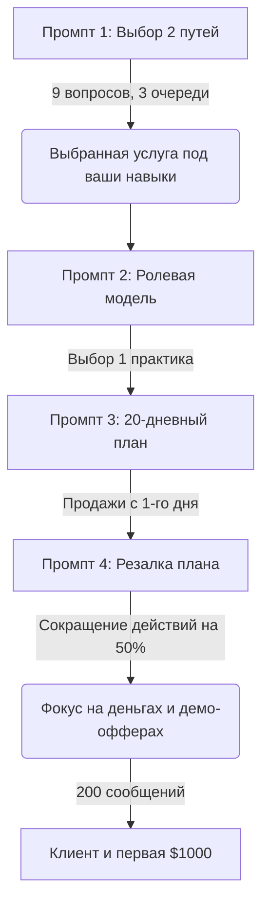

---
tags:
  - ai
  - prompts
  - methodology
  - business
  - workflow
  - mastodont
status: active
created: 2026-05-18
---

# 🚀 Методология Claude Money Prompts: 4 промпта Claude → $1000 за 30 дней

Методология, разработанная ИИ-сообществом **МАСТОДОНТ**, направлена на превращение Claude (веб-версии, Claude Code или API) в бизнес-инкубатор для быстрого тестирования гипотез и выхода на первый доход в **$1000 без вложений, команды и стартовой аудитории**.

Главный принцип методологии — **действия вместо бесконечного обучения** и **продажи с первого дня**.

---

## 🗺 Карта методологии



---

## 💬 Четыре золотых промпта Claude

> [!IMPORTANT]
> Запускайте эти промпты последовательно в одном диалоге, где у Claude накоплено больше всего контекста о вас, ваших навыках и целях.

### 1️⃣ Промпт №1 — Поиск 2 путей к первой $1000
Claude анализирует ваши реальные навыки и предлагает две жизнеспособные услуги, которые можно начать продавать в течение 48 часов без вложений.

```text
Дай мне 2 способа зарабатывать мои первые 1000 баксов за 30 дней. Оба способа должны требовать навыков, которые у меня уже есть, не требовать аудитории, продаваться в течение 48 часов. Задай мне уточняющие вопросы, пока не будешь уверен на 95% в своих рекомендациях.
```

* 💡 **Совет:** Честно отвечайте на уточняющие вопросы (Claude задаст около 9 вопросов в 3 очереди). Если предложенные варианты не нравятся, направляйте ИИ: *"не люблю созваниваться"*, *"нет аккаунта в LinkedIn"*, *"хочу работать текстом через Telegram"*.

---

### 2️⃣ Промпт №2 — Выбор ролевой модели
Вместо покупки десяти разных курсов от «гуру» мы фокусируемся на одном реальном практике в выбранной нише.

```text
Кто один самый успешный человек, у которого мне стоит учиться, чтобы это сделать?
```

* 💡 **Совет (Правило одного источника):** Найдите выбранного эксперта, изучите его подход (2 книги или 5-7 часов видео). Этого достаточно, чтобы понять стандарты рынка и начать делать.

---

### 3️⃣ Промпт №3 — Сжатый 20-дневный план
Стандартные планы обычно растягивают процесс на 90 дней, оставляя продажи на самый конец. Этот промпт разворачивает фокус: продажи и лидогенерация начинаются в первый же день.

```text
Притворись [имя ролевой модели из Шага 2]. Создай 20-дневный план с бюджетом до 1000 долларов, который доводит меня до первого платящего клиента максимально быстро. Привлечение клиентов должно начинаться уже в день один.
```

---

### 4️⃣ Промпт №4 (БОНУС) — Резалка плана (Антипрокрастинатор)
Главное оружие против синдрома самозванца и полировки мелочей. Промпт отсекает 50% лишних действий и оставляет только то, что приносит деньги.

```text
Задай мне 3 вопроса, чтобы понять, что меня остановит на этой неделе. Потом сократи план вдвое и оставь только то, что напрямую ведёт к деньгам.
```

* 🚫 **Что отсекается:** Полировка портфолио, создание визиток, сборка сложного сайта, чтение дополнительных книг.
* ✅ **Что остается:** Прямой контакт с потенциальными клиентами с предложением бесплатного персонализированного демо.

---

## 🎁 Практический кейс: Ниша «Копирайтинг»

Если Claude вывел вас на создание контента / копирайтинг (или вы выбрали этот путь самостоятельно):

### 📍 Ролевая модель: Дмитрий Кот
* Практикующий копирайтер, маркетолог, автор бестселлеров. Реальный специалист, зарабатывающий созданием текстов для бизнеса. Подставьте его имя в **Промпт №3**.

### 💬 Шаблон сообщения (Разрыв шаблона рассылок)
> Никогда не пишите «Хочу предложить свои услуги» или «Давайте посотрудничаем». Присылайте **готовое персонализированное демо** сразу в первом сообщении.

```text
[Имя], увидел анонс вашего курса по искусственному интеллекту. Набросал черновик первого прогревочного поста для вашего канала. Посмотрите [ссылка или текст черновика]. Если зайдёт — готов сделать полный пакет на запуск (9 постов за 4 дня за 350 долларов). Если нет — оставляйте черновик себе бесплатно.
```

---

## 📅 Фазы 20-дневного плана (Копирайтинг / Услуги)

| Фаза | Дни | Фокус | Задачи |
| :--- | :--- | :--- | :--- |
| **01: Холодный старт** | 1 - 4 | Запуск воронки | • Оффер в 1 предложение<br>• Список из 50 экспертов<br>• Отправка по 10-15 сообщений с демо в день |
| **02: Закрытие сделки** | 5 - 10 | Первый контракт | • Постоянный поток сообщений<br>• Работа со входящими откликами<br>• Закрытие первой сделки на $350 |
| **03: Усиление позиции** | 11 - 15 | Сбор кейса | • Качественное выполнение работы<br>• Сбор отзыва и цифр результатов<br>• Публикация кейса, подъем цены до $500 |
| **04: Допродажи** | 16 - 20 | Выход на $1000 | • Допродажа второго проекта первому клиенту *(допродажи закрываются в 70% случаев)* |

---

## 💰 Распределение бюджета на старт ($150 - $300)

| Статья расходов | Сумма | Описание |
| :--- | :--- | :--- |
| **Специализированная литература** | $10 | 1-2 профильные книги для быстрой накачки базы |
| **Мини-лендинг (Tilda / Framer)** | $20 | Простая страница-портфолио с кейсами |
| **Доступ в закрытые чаты экспертов**| $100 - $200 | Основной источник поиска тёплых контактов |
| **Email-валидаторы и парсеры** | $50 | Автоматизация сбора контактов компаний |
| **Резервный фонд** | $100 | Непредвиденные расходы на инструменты |
| **ИТОГО** | **$150 - $300** | Стартовый капитал |

---

## 🎯 Главный инсайт: Математика Объёмов

Успех на 95% зависит от простой воронки контактов:

* **200 сообщений** ➔ 20 ответов ➔ 20 рыночных сигналов (понимание потребностей аудитории, возражений и ценности услуги) ➔ 1-3 закрытые сделки.
* **20 сообщений** ➔ 2 ответа ➔ 0 инсайтов ➔ выгорание и отказ от идеи.

> [!TIP]
> Самый прибыльный навык — это способность монотонно и регулярно делать простую, скучную работу (писать и отправлять персонализированные предложения каждый день).
